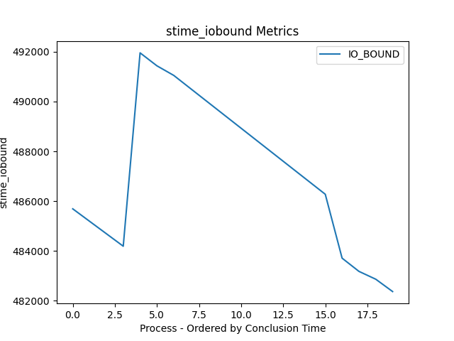
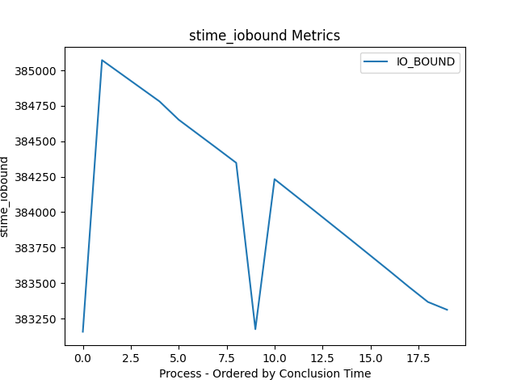
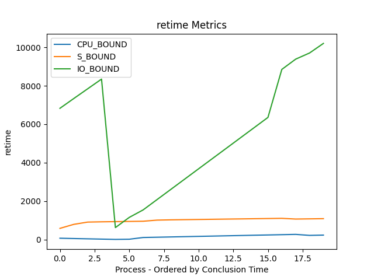
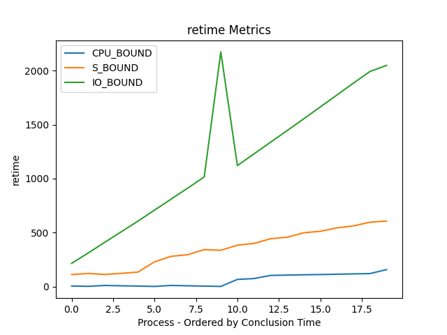
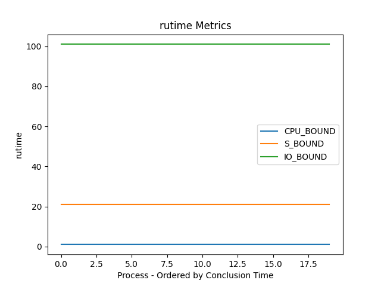
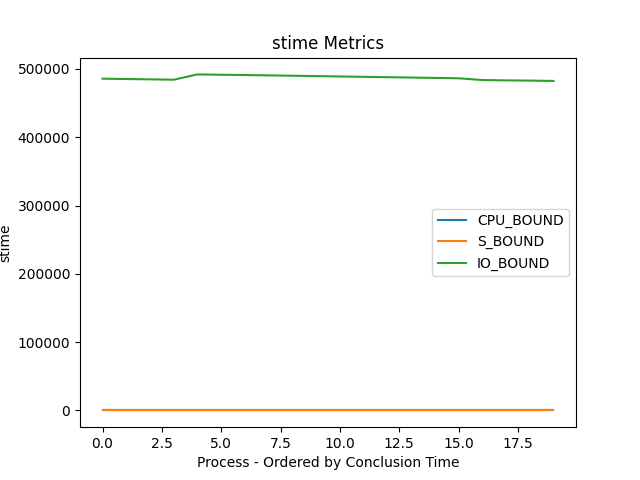
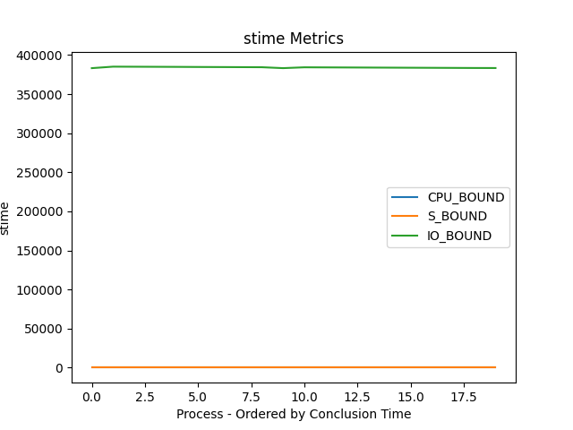

# TP Sistemas Operacionais XV6
## Authors:
Marcos Paulo Ferreira de Souza: https://github.com/MP022
João Vítor Santana Depollo: https://github.com/@JoaoVitorSD
### 1. Introdução
O objetivo deste trabalho é implementar alterações na política de escalonamento do sistema operacional xv6. A maior parte das alterações foram feitas pelas chamadas do scheduler e na inicialização do proc, na função `allocproc()`.
### Scheduller
A prempção do scheduler ocorre com a alteração de um loop que na sua nova versão incrementa uma variável `prempt`, quando atinge o valor da variável `INTERV`, a variável `prempt` tem o seu valor zerado e a função `premptProcess()` é chamada. Através dessa função diferentes políticas de escalonamento são aplicadas para escolher o próximo processo a ser executado de acordo com a sua prioridade.
## Prioridades
Foram definidas 4 níveis de prioridades, sendo eles:
- Low
- Medium
- High
- Realtime
A implementação foi feita via enum, no arquivo `proc.h`:
```c
enum procpriority
{
  LOW,
  MEDIUM,
  HIGH,
  REALTIME
};	
```
## Escalonamento
Cada prioridade possui uma política de escalonamento diferente, e para evitar inanição também foi implementada uma função que aumenta a prioridade dos processos que ficarem X titcks sem serem executados. Neste contexto, foram implementadas as seguintes políticas de escalonamento:
### Realtime
Utiliza o Round Robin, a ideia é que o processo que está a mais tempo sem ser escolhido para ser executado, seja o primeiro a ser executado. Os processos serão executados com um tempo fixo, e depois serão colocados no final da fila novamente. Para esta implementação, é utilizado o valor `last_cycle` do processo, que é incrementado a cada ciclo em que o processo é escolhido para ser executado. Dessa forma, o round_robin vai buscar o processo com o menor `last_cycle` para ser executado.
### High
Baseado no CFS (Completely Fair Scheduler), a ideia é que o processo que tem a menor quantidade de tempo de CPU, seja o próximo a ser executado. Para isso, é utilizado o valor `rutime` do processo, que é incrementado a cada tick que o processo for escolhido para ser executado. Dessa forma, o CFS vai buscar o processo com o menor `rutime` para ser executado. Essa política não gera inanição e dará maior prioridade para os processos que tem menor tempo de CPU, (io-bound).
### Medium
Similar a política do Round Robin, porém essa considera a quantidade de vezes que o processo foi escolhido para ser executado. A ideia é que o processo que foi executado menos vezes, seja o próximo a ser executado. Dessa forma, se um processo p2 chegar após o processo p1, mas o processo p1 já foi executado 3 vezes, e o processo p2 ainda não foi executado, o processo p2 será executado antes do processo p1 por 3 vezes. Dessa forma, é possivel que aconteça uma inação com os processos mais antigos justamente por já terem sido escolhidos diversas vezes para serem executados. 
### Low
Utiliza o FCFS (First Come, First Served), utilizando o valor `ctime` do processo para identificar qual o processo mais antigo. A ideia é que o processo que chegou primeiro, seja o primeiro a ser executado. Com essa política de escalonamento a inação é um problema. No caso do processo mais velho não terminar de executar nunca, já que nessa política o processo só para de executar quando ele termina, os outros processos não serão executados. Mas essa solução funciona bem para processos que ficam mais tempo na cpu (cpu-bound).
## Justificativa
### Realtime
Ser o mais justo possível com os processos, garantindo que todos terão a mesma prioridade,independente do tempo que o processo chegou na cpu, além disso, garantindo a interatividade para processos realtime do sistema.
### High
Priorizar que todos os processos executem a mesma quantidade de tempo, sempre priorizando executar aqueles com menos tempo de execução. Dessa forma garantimos que os processos io-bound, que são processos que passam menos tempo executando e são processos interativos, sejam executados mais rápidamente gerando.
## Medium
Prioriza processos que foram escolhidos poucas ou nenhuma vez. Com esse temos que todos os processos novos seram priozados.
## Low
Pensando em operações de CPU-Bound, essa política garante que os processos que chegaram primeiro sejam executados até o fim. Dessa forma, o `allocproc()` definir a prioridade do processo para `LOW`, permite que os processos de inicialização do sistema sejam executados primeiro. Pois, outros processos criados futuramente, não serão executados até que os processos de inicialização terminem.
# Testes
O arquivo  `sanity.c` recebe um parâmetro *n*, executando a função fork *3n* vezes, assim criando *3n* novos processos. Para cada processo criado será executado uma vez a função `run_bound_loop(type)` que executa o loop de acordo com o tipo do processo. São 3 tipos de processo e para cada tipo existem *n* processos.

Para representar os tipos, foi criado o seguinte enum:
```c
enum proctype
{
    CPU_BOUND,
    S_BOUND,
    IO_BOUND
};
``` 

Para cada processo criado, o processo pai executará a função `wait2`, com o retorno desta chamada, é possível saber qual foi processo que terminou e assim analisar os seus dados de acordo com o seu `proctype`.	Após a execução de todos os processos, o programa imprime a média de tempo de sleeping, ready e o turnaround time,calculado pela soma de stime, rutime e retime.


### System Call Implementadas

#### wait2
Recebe 3 endereços de inteiros e atribui os valores de retime, rutime e stime.

#### yield
Para o `proctype` *S_BOUND*, foi necessário implementar a *system call* `yield()`, que faz com que o processo atual seja colocado no final da fila de execução. Permitindo que para cada 20 iterações do loop, o processo chame o yield.

#### Arquivo syscall.h
```c
#define SYS_wait2  22
#define SYS_yield  23
```
## Resultados

### Consideração
>O loop de 0 a 1 milhão, que é executado para os processos do tipo CPU_BOUND e do tipo S_BOUND, possivelmente foi otimizado pelo compilador, o que fez o tempo de execução desses tipos de processo ser muito menor do que deveria, e isso influenciou os resultados obtidos.

> Pra todos os testes, o valor de *n* passado para o programa sanity foi de 20.

> Para analisar o output do processo, o makefile foi alterado, adicionando o comando `make-output` que salva a saída para um arquivo output.txt. Esta saída foi usada como entrada de um programa python no arquivo `sanity_ouput_analyser.py`, para gerar as tabelas.

### Cenários

#### Cenário 1 - Valores Default (Recomendado pelo professor)
- `INTERV = 5`
- `E1TO2 = 200`
- `E2TO3 = 100`
- `E3TO4 = 50`

#### Cenário 2 - Interv 1
Mesmos valores do cenário 1, porém com `INTERV = 1`

## Sleep Time Para Processos IO Bound

#### Cenário 1


#### Cenário 2


Considerando somente os processos de IO_BOUND, é possível analisar uma propriedade interessante, em que o sleep time vai diminuindo conforme a prioridade do processo aumenta e a quantidade de processos na fila diminui, possivelmente pela menor quantia de trocas de contextos. 
Analisando os 2 cenários, foi possível observar que no cenário 1, com um tempo maior de preempção, o primeiro processo de IO_BOUND teve um tempo de sleep menor, possívelmente, por ter tido menos concorrência com os outros processos.
## Ready Time

#### Cenário 1


#### Cenário 2


Neste caso, os processos de S_BOUND e CPU_BOUND tiveram um tempo de execução próximos, justamente por serem processos que não fazem I/O. Comparando os 2 cenários, o que possui a preempção menor, atingiu um *stime* menor, porque ao entrarem no state de `RUNNABLE` são atendidos mais rapidamente. 

### Rutime

#### Cenário 1


#### Cenário 2


Como o processo de I/O foi simulado com o `sleep()`, é possível perceber que o processo de IO_BOUND tem um grande trade off pela troca de contextos que ele ocorre, em que levou somente um tick para terminar de executar, mas trocou de contexto 100 vezes, levando 101 ticks de rutime. Em sequência, o S_BOUND, que chama o `yield()` a cada 20 iterações, tem um rutime de 21 ticks, justamente por ter trocado de contexto menor vezes. Por fim, o CPU_BOUND, que não faz I/O, tem um rutime de 1, pois é executado quase que instantaneamente. Dessa forma, em ambos os cenários, temos o mesmo comportamente, mas com mais instabilidade no cenário 2, justamente por ter mais trocas de contexto.
### Sleep Time
#### Cenário 1


#### Cenário 2


Como somente o IO_BOUND faz operações de I/O, ele gera uma discrepância nos resultados, em que o sleep time dele é muito maior que os outros processos, justamente por ter que esperar um tempo para que o processo de I/O termine. Por consequência, foi gerado o gráfico de sleep time exclusivo para os processos de IO_BOUND.


## Conclusão

Os resultados foram condizentes com o esperado, em que os processos de IO_BOUND tiveram um tempo de execução maior, justamente por terem que esperar um tempo para que o processo de I/O termine. Em contrapartida, os processos de S_BOUND e CPU_BOUND tiveram um tempo de execução menor. Além disso, foi possível observar que a política de escalonamento implementada foi eficaz, em que os processos de IO_BOUND foram executados de forma justa, sem que um processo monopolizasse a CPU.